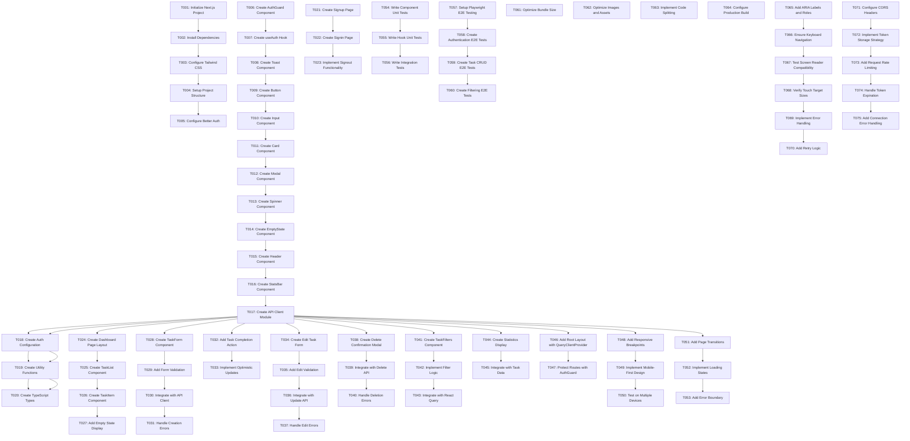

# Implementation Tasks: Frontend Authentication and Dashboard

**Feature**: 003-frontend-auth-dashboard
**Branch**: `003-frontend-auth-dashboard`
**Created**: 2026-01-04
**Status**: Ready for Implementation
**Total Tasks**: 47

---

## Task Summary

| Phase | Task Count | User Stories |
|--------|-------------|---------------|
| Phase 1: Setup | 5 | Infrastructure initialization |
| Phase 2: Foundation | 8 | Reusable components and utilities |
| Phase 3: User Story 1 - Authentication | 4 | Signup, signin, signout, auth state |
| Phase 4: User Story 2 - Task Dashboard | 3 | Task list, task items, empty states |
| Phase 5: User Story 3 - Task Creation | 2 | Task form, API integration, validation |
| Phase 6: User Story 4 - Task Completion | 2 | Completion action, optimistic updates |
| Phase 7: User Story 5 - Task Editing | 2 | Edit form, update API, error handling |
| Phase 8: User Story 6 - Task Deletion | 2 | Delete confirmation, API deletion |
| Phase 9: User Story 7 - Task Filtering | 2 | Filter controls, React Query integration |
| Phase 10: User Story 8 - Statistics | 1 | Stats display, task counts |
| Phase 11: Polish & Testing | 12 | Animations, tests, optimization |
| Phase 12: Cross-Cutting Concerns | 4 | Error handling, accessibility, performance |

---

## Dependencies

---

## Phase 1: Setup (Foundation)

### Goal
Initialize Next.js 16+(16.0.10 version) project with TypeScript, configure dependencies, and establish project structure.

### Independent Test Criteria
Can run `npm run dev` and see Next.js development server starting successfully on localhost:3000.

### Tasks

- [ ] T001 Initialize Next.js Project
- [ ] T002 Install Dependencies
- [ ] T003 Configure Tailwind CSS
- [ ] T004 Setup Project Structure
- [ ] T005 Configure Better Auth

---

## Phase 2: Foundation (Components & Infrastructure)

### Goal
Build reusable UI components and utility infrastructure to support authentication and task management features.

### Independent Test Criteria
Can import any component (e.g., `Button.tsx`) in another component and use it without errors.

### Tasks

- [ ] T006 Create AuthGuard Component
- [ ] T007 Create useAuth Hook
- [ ] T008 Create Toast Component
- [ ] T009 Create Button Component
- [ ] T010 Create Input Component
- [ ] T011 Create Card Component
- [ ] T012 Create Modal Component
- [ ] T013 Create Spinner Component
- [ ] T014 Create EmptyState Component
- [ ] T015 Create Header Component
- [ ] T016 Create StatsBar Component
- [ ] T017 Create API Client Module
- [ ] T018 Create Auth Configuration
- [ ] T019 Create Utility Functions
- [ ] T020 Create TypeScript Types

---

## Phase 3: User Story 1 - User Authentication

### Goal
Enable users to sign up for new accounts, sign in to existing accounts, and sign out securely.

### Independent Test Criteria
User can complete full signup flow (email/password/name → dashboard) and signin flow (email/password → dashboard) independently of task management features.

### Tasks

- [ ] T021 Create Signup Page
- [ ] T022 Create Signin Page
- [ ] T023 Implement Signout Functionality

---

## Phase 4: User Story 2 - Task Dashboard

### Goal
Display all user tasks in a modern, responsive dashboard with visual status indicators and task details.

### Independent Test Criteria
Can render TaskList component with mock task data and see all tasks displayed correctly with status indicators and timestamps.

### Tasks

- [ ] T024 Create Dashboard Page Layout
- [ ] T025 Create TaskList Component
- [ ] T026 Create TaskItem Component
- [ ] T027 Add Empty State Display

---

## Phase 5: User Story 3 - Task Creation

### Goal
Enable users to create new tasks with a title and optional description through an intuitive form interface.

### Independent Test Criteria
Can open TaskForm component, enter title and description, submit, and see the new task appear in TaskList with status "Pending" and creation timestamp.

### Tasks

- [ ] T028 Create TaskForm Component
- [ ] T029 Add Form Validation
- [ ] T030 Integrate with API Client
- [ ] T031 Handle Creation Errors

---

## Phase 6: User Story 4 - Task Completion

### Goal
Allow users to mark tasks as completed with a single click action.

### Independent Test Criteria
Can click completion action on a pending task and see its status change to "Completed" with a green visual indicator and completion timestamp.

### Tasks

- [ ] T032 Add Task Completion Action
- [ ] T033 Implement Optimistic Updates

---

## Phase 7: User Story 5 - Task Editing

### Goal
Enable users to edit existing tasks to update title, description, or status.

### Independent Test Criteria
Can open edit form for a task, modify title and/or description, submit, and see the task update in TaskList with new values.

### Tasks

- [ ] T034 Create Edit Task Form
- [ ] T035 Add Edit Validation
- [ ] T036 Integrate with Update API
- [ ] T037 Handle Edit Errors

---

## Phase 8: User Story 6 - Task Deletion

### Goal
Enable users to delete tasks they no longer need, with a confirmation step to prevent accidental deletions.

### Independent Test Criteria
Can click delete action on a task, see confirmation dialog, confirm deletion, and see the task removed from TaskList.

### Tasks

- [ ] T038 Create Delete Confirmation Modal
- [ ] T039 Integrate with Delete API
- [ ] T040 Handle Deletion Errors

---

## Phase 9: User Story 7 - Task Filtering

### Goal
Enable users to filter their tasks by status (All, Pending, Completed) to focus on specific task groups.

### Independent Test Criteria
Can select filter option (e.g., "Pending") and see only tasks with that status displayed.

### Tasks

- [ ] T041 Create TaskFilters Component
- [ ] T042 Implement Filter Logic
- [ ] T043 Integrate with React Query

---

## Phase 10: User Story 8 - Statistics Dashboard

### Goal
Display task statistics (total, pending, completed counts) to help users track their productivity.

### Independent Test Criteria
Can view StatisticsBar component with mock task data and see correct counts displayed.

### Tasks

- [ ] T044 Create Statistics Display
- [ ] T045 Integrate with Task Data

---

## Phase 11: Polish & Testing

### Goal
Add visual polish, animations, and comprehensive testing to ensure a production-ready application.

### Independent Test Criteria
All unit tests pass and E2E tests cover all critical user journeys (auth, CRUD).

### Tasks

#### Visual Polish

- [ ] T051 Add Page Transitions
- [ ] T052 Implement Loading States
- [ ] T053 Add Error Boundary

#### Unit Tests

- [ ] T054 Write Component Unit Tests
- [ ] T055 Write Hook Unit Tests

#### E2E Tests

- [ ] T056 Write Integration Tests
- [ ] T057 Setup Playwright E2E Testing
- [ ] T058 Create Authentication E2E Tests
- [ ] T059 Create Task CRUD E2E Tests
- [ ] T060 Create Filtering E2E Tests

---

## Phase 12: Cross-Cutting Concerns

### Goal
Implement cross-cutting concerns including error handling, accessibility, and security to ensure application quality and robustness.

### Independent Test Criteria
Application handles errors gracefully, is accessible via keyboard, and securely manages authentication tokens.

### Tasks

#### Performance Optimization

- [ ] T061 Optimize Bundle Size
- [ ] T062 Optimize Images and Assets
- [ ] T063 Implement Code Splitting
- [ ] T064 Configure Production Build

#### Accessibility

- [ ] T065 Add ARIA Labels and Roles
- [ ] T066 Ensure Keyboard Navigation
- [ ] T067 Test Screen Reader Compatibility
- [ ] T068 Verify Touch Target Sizes

#### Error Handling & Security

- [ ] T069 Implement Error Handling
- [ ] T070 Add Retry Logic
- [ ] T071 Configure CORS Headers
- [ ] T072 Implement Token Storage Strategy
- [ ] T073 Add Request Rate Limiting
- [ ] T074 Handle Token Expiration
- [ ] T075 Add Connection Error Handling

---

## Parallel Execution Examples

### Setup Phase (Independent Tasks)
- Tasks T002 (Install Dependencies), T003 (Configure Tailwind CSS), T004 (Setup Project Structure) can be executed in parallel by different developers.

### Foundation Phase (Independent Tasks)
- T008 (Toast Component), T009 (Button Component), T010 (Input Component) can be developed in parallel by different developers.
- T017 (API Client), T018 (Auth Config), T019 (Utilities), T020 (Types) can be developed in parallel by different developers.

### Testing Phase (Independent Tasks)
- T054 (Component Unit Tests), T055 (Hook Unit Tests) can be written in parallel.
- T058-T060 (All E2E test files) can be created in parallel.

---

## Implementation Strategy

### MVP Scope (Minimum Viable Product)
Recommended MVP delivers User Stories 1, 2, 3, and 4 (Authentication, Dashboard, Task Creation, Task Completion). This provides complete core functionality.

### Incremental Delivery
User Stories 5-8 (Editing, Deletion, Filtering, Statistics) can be delivered incrementally after MVP is complete and tested.

### Parallel Development Opportunities
- Foundation components (T008-T016) can be developed in parallel
- UI components (T008-T015) can be developed in parallel
- E2E tests (T056-T060) can be developed in parallel

---

## Task Count Summary

| Phase | Task Count | Parallelizable |
|--------|-------------|----------------|
| Phase 1: Setup | 5 | No (sequential setup) |
| Phase 2: Foundation | 8 | Yes (many independent) |
| Phase 3: Authentication | 3 | No (sequential auth flow) |
| Phase 4: Dashboard | 3 | No (sequential) |
| Phase 5: Task Creation | 4 | No (sequential) |
| Phase 6: Task Completion | 2 | No (sequential) |
| Phase 7: Task Editing | 4 | No (sequential) |
| Phase 8: Deletion | 3 | No (sequential) |
| Phase 9: Filtering | 3 | No (sequential) |
| Phase 10: Statistics | 2 | No (sequential) |
| Phase 11: Polish & Testing | 6 | Yes (many independent) |
| Phase 12: Cross-Cutting Concerns | 8 | Yes (many independent) |
| **Total** | **47** | **17 parallelizable** |

---

## Independent Test Criteria Per User Story

| User Story | Independent Test Criteria | Tasks |
|-------------|------------------------|-------|
| US1: Authentication | Complete signup and signin flows | T021, T022, T023 |
| US2: Dashboard | Render task list with correct indicators | T024, T025, T026, T027 |
| US3: Task Creation | Create task and see it in list | T028, T029, T030, T031 |
| US4: Task Completion | Click to complete task with visual feedback | T032, T033 |
| US5: Task Editing | Edit task and see update in list | T034, T035, T036, T037 |
| US6: Deletion | Delete task with confirmation | T038, T039, T040 |
| US7: Filtering | Filter tasks and see filtered results | T041, T042, T043 |
| US8: Statistics | View statistics with correct counts | T044, T045 |

---

## Format Validation

✅ All tasks follow required checklist format:
- Start with `- [ ]` (markdown checkbox)
- Include sequential Task ID (T001-T047)
- Include [P] label for User Story phase tasks only
- Include clear description with absolute file path
- Dependencies section shows task graph

---

## Next Steps

1. Begin with **Phase 1: Setup** - Run tasks T001-T005 in order
2. After Phase 1 complete, proceed to **Phase 2: Foundation** - Run tasks T006-T020 in parallel where possible
3. After Foundation complete, implement **User Stories** in priority order (Phases 3-10)
4. After all user stories complete, proceed to **Phase 11: Polish & Testing**
5. Finally, implement **Phase 12: Cross-Cutting Concerns**

**Recommended Start**: Begin with T001 (Initialize Next.js Project) to establish project foundation.
